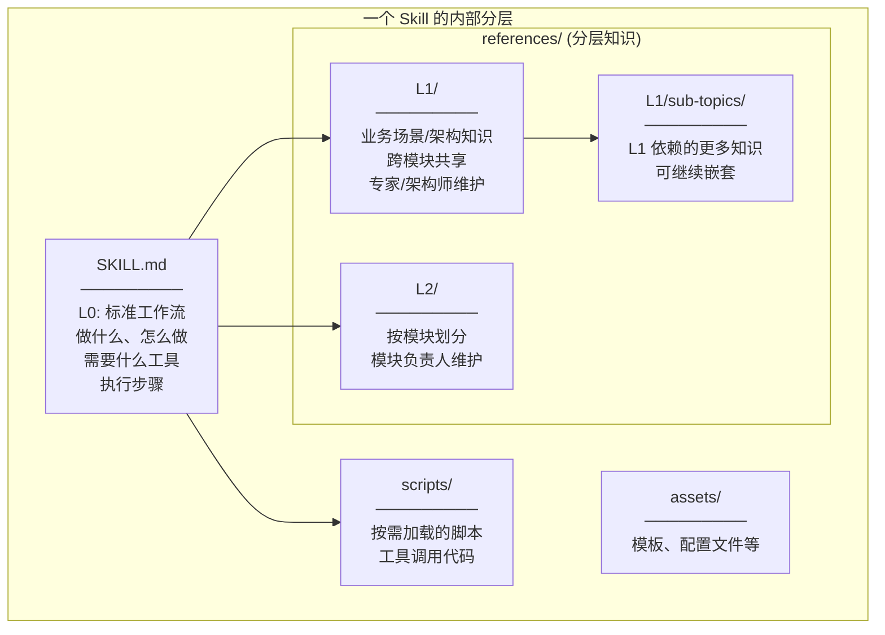
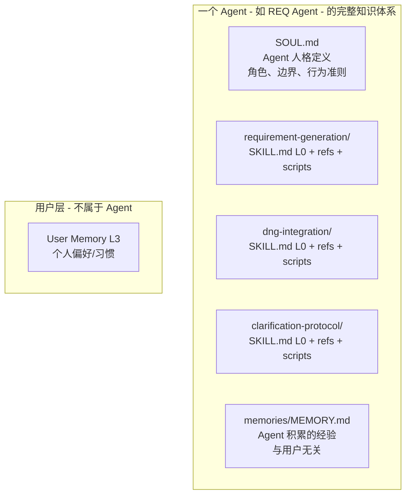
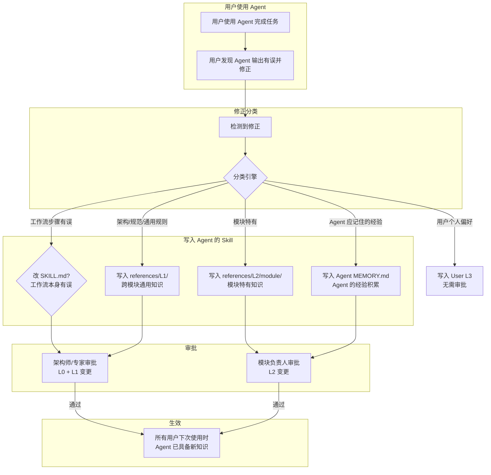
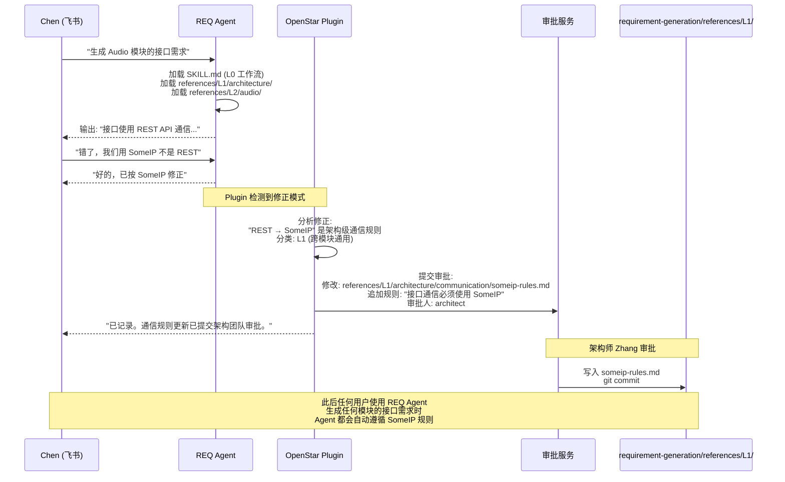
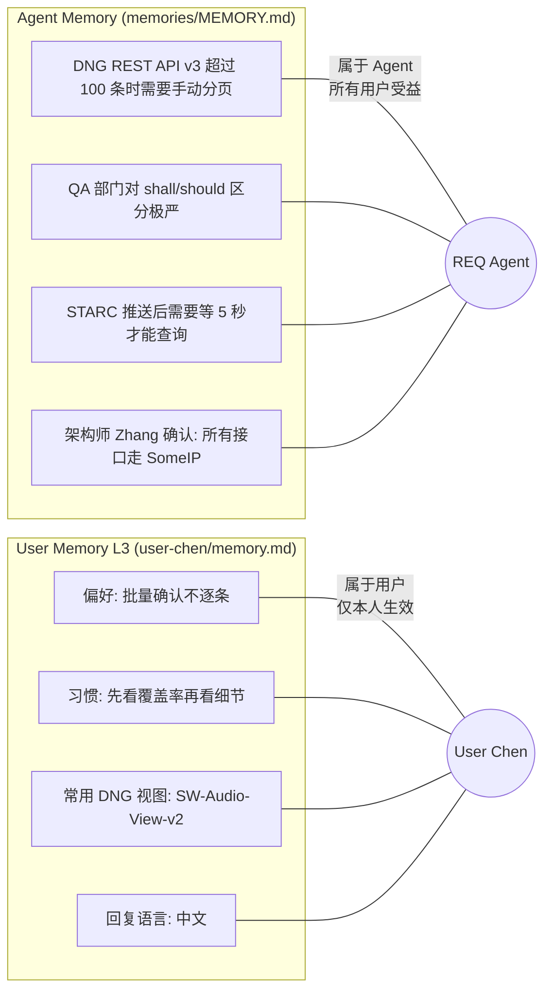
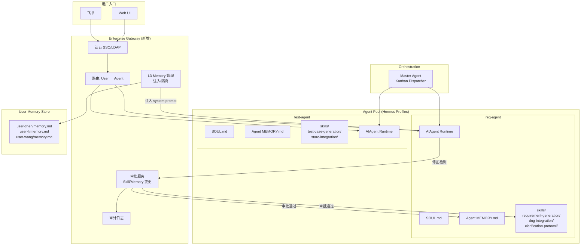
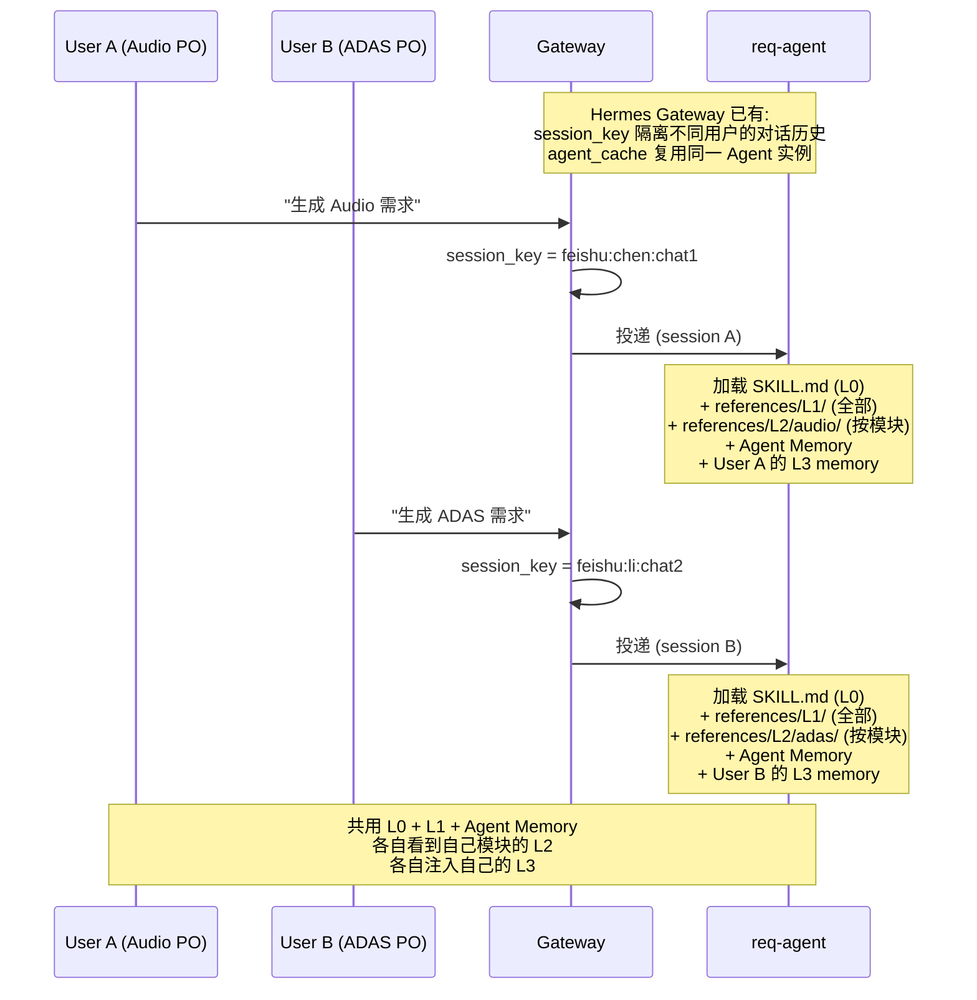
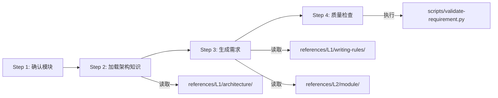
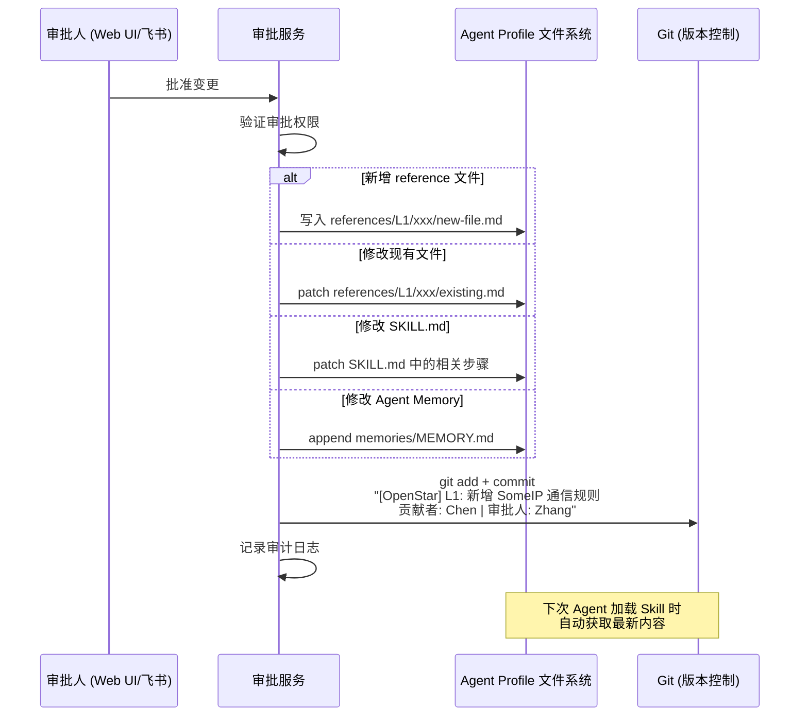
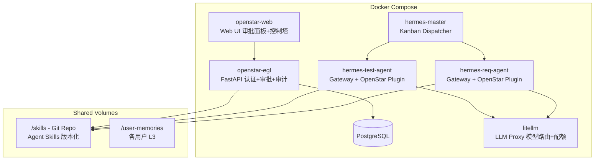

# OpenStar 技术方案：基于 Hermes Agent 的企业数字员工平台

**Version:** 3.0  
**Author:** Vidge  
**Date:** 2026-05-31  
**Status:** Technical Proposal

---

## 1. 核心概念模型

### 1.1 问题本质

OpenStar 的核心诉求是：**多个用户共用一个 Agent（如 REQ Agent），每个人在使用中产生的经验和修正，能否经审批后沉淀到这个 Agent 的知识里，让所有人受益。**

```
多个用户 ──使用──→ 同一个 Agent ──拥有──→ 分层知识 (Skill 内部分层)
    │                                           ↑
    └──修正/贡献──→ 审批流 ──通过后──→ 写入 ──────┘
```

### 1.2 Skill 的正确结构

参考 [agentskills.io](https://agentskills.io/home) 的标准：

> A skill is a folder containing a SKILL.md file. Skills can also bundle scripts, reference materials, templates, and other resources.

**一个 Skill 就是一个完整的能力单元：**

```
my-skill/
├── SKILL.md          # Required: metadata + instructions (这就是 L0)
├── scripts/          # Optional: executable code (按需加载)
├── references/       # Optional: documentation (L1 + L2 在这里分层)
├── assets/           # Optional: templates, resources
└── ...
```

### 1.3 知识分层在 Skill 内部

**分层不是在 skills/ 目录下建 L0/ L1/ L2/ 子文件夹，而是在每个 Skill 内部通过 `SKILL.md` + `references/` 来组织分层。**



**关键原则：**
- **SKILL.md 就是 L0** — 定义标准工作流（与用户无关，与模块无关）
- **references/L1/** — 架构/流程/规范知识，跨模块通用，架构师维护
- **references/L1/xxx/yyy/** — L1 依赖的子知识，继续在 L1 下嵌套
- **references/L2/** — 按模块分文件夹，各模块负责人维护
- **scripts/** — 工具脚本，按需加载
- **Agent 的 MEMORY.md** — Agent 级别积累经验（独立于 Skill，也属于 Agent）

### 1.4 完整的 Agent 知识体系



---

## 2. Skill 内部结构详细设计

### 2.1 REQ Agent 的核心 Skill 示例

```
~/.hermes/profiles/req-agent/
├── SOUL.md                                    # Agent 人格 (与用户无关)
├── config.yaml                                # Agent 配置
├── memories/
│   └── MEMORY.md                              # Agent Memory (积累的经验)
│
└── skills/
    ├── requirement-generation/                 # Skill: 需求生成
    │   ├── SKILL.md                           # L0: 标准工作流
    │   ├── scripts/
    │   │   ├── validate-requirement.py        # 需求格式校验脚本
    │   │   └── trace-link-checker.py          # 追溯链检查脚本
    │   ├── references/
    │   │   ├── L1/                            # 业务场景知识 (架构师维护)
    │   │   │   ├── architecture/
    │   │   │   │   ├── system-overview.md     # 系统架构总览
    │   │   │   │   ├── qnx-android-split.md  # QNX+Android 分层
    │   │   │   │   └── communication/        # 通信相关 (L1 嵌套)
    │   │   │   │       ├── someip-rules.md
    │   │   │   │       ├── ipc-protocol.md
    │   │   │   │       └── interface-defs/
    │   │   │   │           ├── someip-api.yaml
    │   │   │   │           └── dbus-services.md
    │   │   │   ├── aspice/
    │   │   │   │   ├── swe1-process.md        # SWE.1 过程域规范
    │   │   │   │   └── qa-attributes.md       # QA 属性标准
    │   │   │   └── writing-rules/
    │   │   │       ├── requirement-format.md  # 需求写作规范
    │   │   │       └── shall-should-rules.md  # shall/should 用词规则
    │   │   │
    │   │   └── L2/                            # 模块专属知识 (模块负责人维护)
    │   │       ├── audio/
    │   │       │   ├── audio-module-rules.md  # 音频模块特定规则
    │   │       │   ├── codec-constraints.md   # 编解码器约束
    │   │       │   └── fade-timing.md         # 淡入淡出时序标准
    │   │       ├── adas/
    │   │       │   ├── safety-levels.md       # ASIL 安全等级
    │   │       │   └── sensor-interfaces.md   # 传感器接口规范
    │   │       └── health-monitor/
    │   │           ├── hm-requirements.md     # HM 模块需求模式
    │   │           └── watchdog-rules.md      # 看门狗相关规则
    │   │
    │   └── assets/
    │       └── templates/
    │           └── sw-requirement-template.md  # 软件需求模板
    │
    ├── dng-integration/                        # Skill: DNG 系统集成
    │   ├── SKILL.md                           # L0: DNG 操作流程
    │   ├── scripts/
    │   │   ├── dng-read.py                    # DNG REST API 读取
    │   │   └── dng-push.py                    # DNG 推送脚本
    │   └── references/
    │       ├── L1/
    │       │   ├── dng-api-guide.md           # DNG API 使用指南
    │       │   └── dng-pagination-quirks.md   # DNG 分页注意事项
    │       └── L2/
    │           ├── audio/
    │           │   └── audio-dng-views.md     # 音频模块 DNG 视图配置
    │           └── adas/
    │               └── adas-dng-views.md      # ADAS DNG 视图配置
    │
    └── clarification-protocol/                 # Skill: 澄清协议
        ├── SKILL.md                           # L0: 缺少信息时如何询问
        └── references/
            └── L1/
                └── common-missing-info.md     # 常见缺失信息模式
```

### 2.2 SKILL.md (L0) 示例

```markdown
---
name: requirement-generation
description: "Generate software requirements from system requirements following ASPICE SWE.1"
version: 1.2.0
metadata:
  hermes:
    tags: [aspice, swe1, requirements, dng]
    tools_required: [dng-read, dng-push, terminal]
    related_skills: [dng-integration, clarification-protocol]
---

# Requirement Generation (SWE.1)

## Overview
从系统需求生成完整的软件需求，遵循 ASPICE SWE.1 过程域标准。

## When to Use
- 用户请求生成/更新软件需求
- 检测到上游系统需求变更
- 模块初始化需要建立需求基线

## Prerequisites
- 系统需求已在 DNG 中就绪
- 用户已确认目标模块

## Workflow

### Step 1: 确认上下文
1. 确认目标模块 (从用户消息或 L3 memory 推断)
2. 从 references/L1/architecture/ 加载该模块对应的架构知识
3. 从 references/L2/{module}/ 加载模块专属规则
4. 如果缺少必要信息，使用 clarification-protocol Skill 询问

### Step 2: 摄取系统需求
1. 使用 dng-integration Skill 读取系统需求
2. 交叉引用 references/L1/architecture/system-overview.md
3. 识别该模块相关的系统需求子集

### Step 3: 生成软件需求
1. 按 references/L1/writing-rules/requirement-format.md 格式生成
2. 每条需求包含:
   - 唯一标识符
   - 需求描述 (遵循 shall/should 规则)
   - 追溯链 (关联的系统需求 ID)
   - 验证准则
   - 接口规格 (参考 L1/architecture/communication/)
3. 遵循 references/L2/{module}/ 中的模块特定约束

### Step 4: 质量检查
1. 运行 scripts/validate-requirement.py 检查格式合规
2. 运行 scripts/trace-link-checker.py 检查追溯完整性
3. 按 references/L1/aspice/qa-attributes.md 检查 QA 属性

### Step 5: 迭代确认
1. 向用户展示生成结果摘要
2. 接受用户修正
3. 修正后重新执行质量检查

### Step 6: 推送
1. 使用 dng-integration Skill 推送至 DNG (草案状态)
2. 通知用户完成情况

## Notes
- 生成过程中，如果检测到参考代码与新系统需求冲突，需标记并通知
- 优先级: 新系统需求 > 架构知识 > 参考代码
- 永远不自动提升到正式状态，仅产出草案
```

### 2.3 references/L1/ 内的嵌套示例

```markdown
# references/L1/architecture/communication/someip-rules.md

# SomeIP 通信规则

## 适用范围
所有跨进程、跨 ECU 的服务调用。

## 规则
1. 所有服务接口必须使用 SomeIP，禁止直接 TCP/UDP socket
2. Service Discovery 必须启用，不允许硬编码地址
3. Event 通知使用 SomeIP Event Group，不允许轮询
4. 序列化使用 SomeIP 原生序列化，不允许额外 Protobuf 层

## 接口定义
详见 interface-defs/someip-api.yaml

## 例外
- Android 内部组件间通信使用 AIDL/Binder
- 诊断通道使用 UDS (ISO 14229)

## 更新记录
- 2026-05-15: 架构师 Zhang 确认 SomeIP Event Group 规则 (来自 User Chen 的修正)
```

---

## 3. 知识互惠机制

### 3.1 互惠的本质



### 3.2 具体场景

**场景：User Chen 使用 REQ Agent 生成需求，发现 Agent 不知道 SomeIP 规则**



### 3.3 写入的粒度

| 修正类型 | 写入位置 | 举例 | 审批人 |
|---|---|---|---|
| 工作流本身有误 | `SKILL.md` (L0) | "应该先检查追溯链再推送" | 架构师 |
| 架构/通信/流程规范 | `references/L1/xxx.md` | "必须用 SomeIP" | 架构师 |
| L1 依赖的子知识 | `references/L1/topic/sub-topic/` | 新增接口定义文件 | 架构师 |
| 模块特有规则 | `references/L2/module/xxx.md` | "Audio 淡出必须 300ms" | 模块负责人 |
| Agent 的经验教训 | `memories/MEMORY.md` | "DNG API 分页有 bug" | 模块负责人 |
| 用户个人偏好 | 用户自己的 L3 memory | "我喜欢批量确认" | 无需审批 |

---

## 4. Agent Memory vs User Memory

### 4.1 区分



### 4.2 Agent Memory 也需要审批

Agent Memory 记录的是 Agent 的**公共经验**，会影响所有用户。所以写入 Agent Memory 同样需要审批：

- Agent 自动发现的经验 → 提交审批 → 模块负责人确认 → 写入
- 用户显式告知 Agent 记住的东西 → 判断是个人偏好(L3)还是公共经验(Agent Memory) → 后者需审批

---

## 5. 系统架构

### 5.1 总体架构



### 5.2 多用户共用 Agent — Session 隔离



### 5.3 references 按需加载机制

SKILL.md 中声明的工作流步骤引用 references，Agent 在执行时按需读取：



**scripts/ 也是按需加载** — 不是所有脚本都在每次执行时运行，而是 SKILL.md 工作流中指定在特定步骤调用。

---

## 6. 技术实现

### 6.1 OpenStar Plugin (核心组件)

整个治理逻辑通过一个 Hermes Plugin 实现，零侵入内核：

```python
class OpenStarPlugin:
    """
    Hermes Plugin — 企业治理层。
    利用 Hermes 已有的 Hook 机制注入:
    1. pre_gateway_dispatch: 认证 + L3 注入 + 模块解析
    2. pre_tool_call: 拦截对 Agent Skill/Memory 的写入
    3. post_llm_call: 修正检测 + 分类
    """

    # --- 认证 + L3 注入 ---
    def pre_gateway_dispatch(self, event, gateway, session_store):
        user = self.authenticate(event.source)
        if not user:
            return {"action": "skip"}
        
        # 确定用户所属模块 → 决定加载哪个 L2
        module = user.module  # "audio" / "adas" / ...
        
        # 注入 L3 memory + 模块信息到 session context
        l3_memory = self.load_user_memory(user.id)
        event.metadata["openstar_context"] = {
            "user": user,
            "module": module,
            "l3_memory": l3_memory,
            "l2_filter": f"references/L2/{module}/"
        }
        return {"action": "allow"}

    # --- 拦截 Agent 知识写入 ---
    def pre_tool_call(self, tool_name, args, agent):
        if tool_name == "skill_manage":
            return self._gate_skill_write(args)
        if tool_name == "memory_write":
            return self._gate_agent_memory_write(args)
        return None

    def _gate_skill_write(self, args):
        path = args.get("path", "")
        
        # 写入 SKILL.md (L0) → 架构师审批
        if path.endswith("SKILL.md"):
            self.submit_approval("L0", args, approver="architect")
            return {"action": "block", "message": "L0 工作流变更已提交架构师审批"}
        
        # 写入 references/L1/ → 架构师审批
        if "/references/L1/" in path:
            self.submit_approval("L1", args, approver="architect")
            return {"action": "block", "message": "L1 知识变更已提交架构师审批"}
        
        # 写入 references/L2/ → 模块负责人审批
        if "/references/L2/" in path:
            module = self._extract_module_from_path(path)
            self.submit_approval("L2", args, approver=f"owner:{module}")
            return {"action": "block", "message": f"L2 变更已提交 {module} 负责人审批"}
        
        # scripts/ 写入 → 架构师审批 (代码变更)
        if "/scripts/" in path:
            self.submit_approval("script", args, approver="architect")
            return {"action": "block", "message": "脚本变更已提交审批"}
        
        return None

    # --- 修正检测 ---
    def post_llm_call(self, messages, response, agent):
        correction = self._detect_user_correction(messages)
        if correction:
            classification = self._classify_correction(correction)
            # classification: {level: "L1", topic: "communication", ...}
            self._submit_as_knowledge_contribution(classification, correction)
```

### 6.2 L2 模块动态过滤

**问题：** 一个 Skill 的 `references/L2/` 下有多个模块的文件夹，不同用户只应看到自己模块的。

**方案：** Plugin 在 prompt 构建时，根据用户模块过滤 L2 references 的加载。

```python
def on_skill_load(self, skill_path, agent_context):
    """Hook: Skill 加载时过滤 references/L2/"""
    module = agent_context.get("openstar_module")
    if not module:
        return  # 不过滤
    
    l2_path = skill_path / "references" / "L2"
    if l2_path.exists():
        # 只保留当前用户模块的 L2 子目录
        for subdir in l2_path.iterdir():
            if subdir.is_dir() and subdir.name != module:
                # 标记为本次 session 不加载
                agent_context.setdefault("excluded_refs", []).append(str(subdir))
```

### 6.3 审批后的写入流程



---

## 7. 部署方案

### 7.1 容器部署



### 7.2 知识版本化

```bash
# Agent 的 skills 目录作为 Git Repo
~/.hermes/profiles/req-agent/skills/
├── .git/
├── requirement-generation/
│   ├── SKILL.md
│   ├── scripts/
│   └── references/
│       ├── L1/
│       └── L2/
└── dng-integration/
    └── ...

# 每次审批通过的变更 = 一次 git commit
# 回滚 = git revert
# 审计 = git log --all
# 知识演进可视化 = git log --graph
```

---

## 8. 对比总结

### 8.1 为什么这个结构是对的

| 原则 | 说明 |
|---|---|
| **Skill = 完整能力单元** | 一个文件夹就是一个能力，包含工作流 + 知识 + 脚本 |
| **SKILL.md = L0** | 标准工作流定义，与用户/模块无关 |
| **references/ 内分层** | L1 (通用) 和 L2 (模块) 在同一 Skill 的 references 内组织 |
| **L1 可嵌套** | `references/L1/topic/sub-topic/` 无限深度 |
| **scripts/ 按需加载** | SKILL.md 指定哪个步骤调用哪个脚本 |
| **Agent Memory 独立** | 不在 Skill 内，是 Agent 级别的经验积累 |
| **User L3 不属于 Agent** | 外部注入，不影响 Agent 的知识体系 |

### 8.2 与 Claude Agent SDK 对比

| | Hermes + OpenStar Plugin | Claude Agent SDK 从零建 |
|---|---|---|
| Skill 系统 | ✅ 原生支持完整结构 | ❌ 需自建 |
| references/ 嵌套 | ✅ 已支持 | ❌ 需设计 |
| scripts/ 执行 | ✅ 原生工具调用 | ⚠️ 需接入 |
| 多用户 Session 隔离 | ✅ Gateway ContextVar | ❌ 需实现 |
| Plugin Hook (零侵入治理) | ✅ 5 种 Hook 点 | ❌ 无此机制 |
| 飞书 Gateway | ✅ 原生适配器 | ❌ 需 2-3 周开发 |
| Kanban 编排 | ✅ SQLite CAS 跨 Profile | ❌ 需设计+实现 |
| **新增开发量** | **~10 周** (Plugin + EGL + Web UI) | **~25 周** (全部) |

---

## 9. 实施路线

| Phase | 周期 | 交付物 |
|---|---|---|
| **0: 验证** | 2 周 | 手工搭建 1 个 req-agent Profile + 飞书接入 + 2 用户验证 |
| **1: Plugin + 审批** | 4 周 | OpenStar Plugin + 审批服务 + L3 注入 + 基础 Web UI |
| **2: 修正闭环** | 3 周 | 修正检测 + LLM 分类 + 自动提交审批 + Agent Memory 积累 |
| **3: 多 Agent** | 3 周 | test-agent + quality-agent + Master Agent 编排 |

---

*End of Document v3.0*
